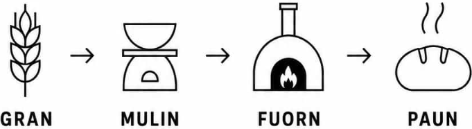

# #FuornAviert

### A #PlanD TEST project

**GRAN → MULIN → FUORN → PAUN**

Grain → Mill → Oven → Bread

What still works when normal infrastructure does not?

#FuornAviert investigates the conditions under which a regional bread supply chain can continue to function when established infrastructures are disrupted.

The project examines dependencies, available resources, local capabilities and opportunities for cooperation.

## Part of #PlanD

#PlanD operates through four interconnected operations:

1. OBSERVE – Where are we? Where do we want to be?
2. PARAMETRIZE – What matters?
3. ENABLE – What becomes possible?
4. TEST – What works?

#FuornAviert belongs to operation 4: TEST.

## What we want to test

- Which parts of the grain-to-bread chain already work locally?
- Which dependencies could interrupt the process?
- What infrastructures, skills and forms of cooperation are required?
- What remains possible under changing conditions?
- What can be learned through practical experimentation?

## Open development

#FuornAviert is not a finished solution. It is an open test of regional infrastructure, cooperation and resilience.

The project is connected to #AutarkieIndex, which focuses on needs, not wants, and investigates what remains available under changing conditions.

## References

- [#FuornAviert](https://dissent.is/FuornAviert)
- [#PlanD](https://github.com/sms2sms/PlanD)
- [#AutarkieIndex](https://github.com/sms2sms/AutarkieIndex)
- [Q102014 – Setting](https://github.com/Q102014/setting)

## License

CC0 1.0 Universal – Public Domain Dedication.
